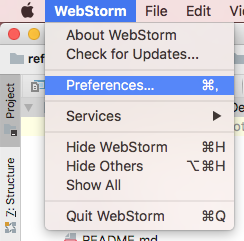
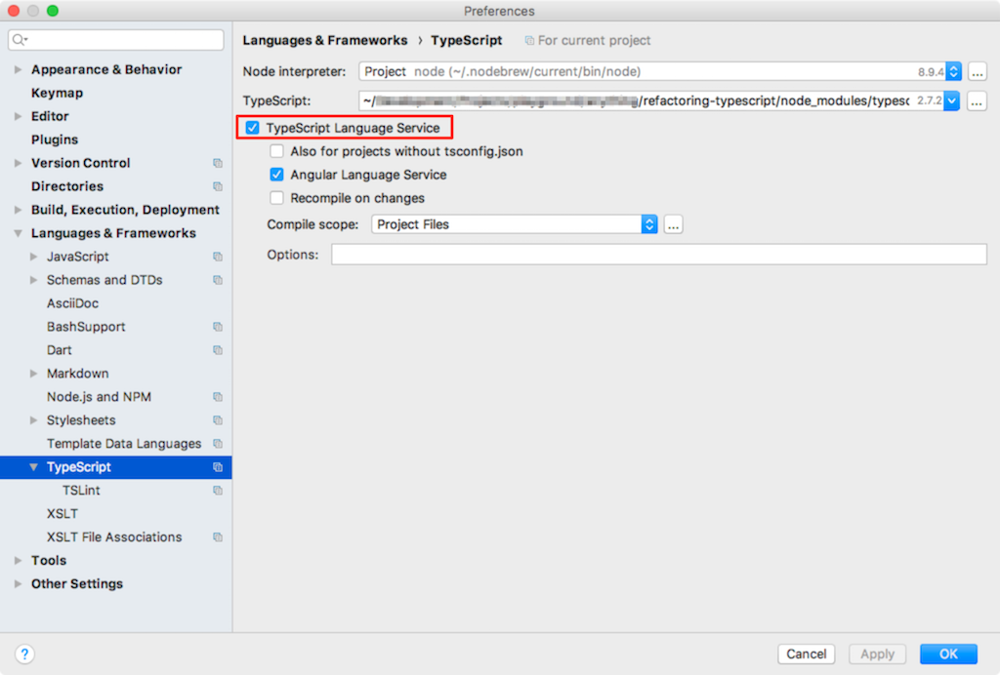
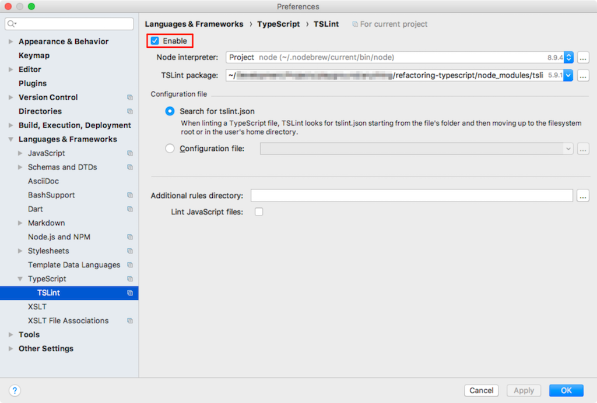
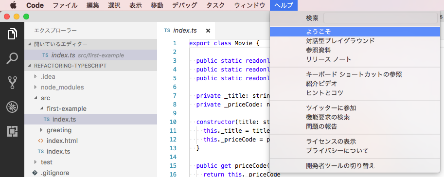
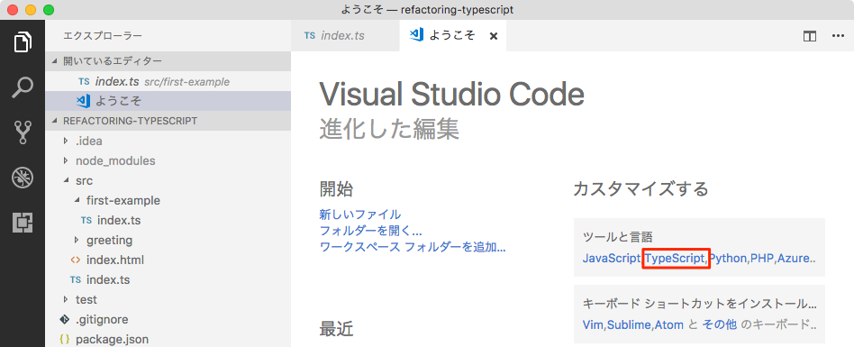
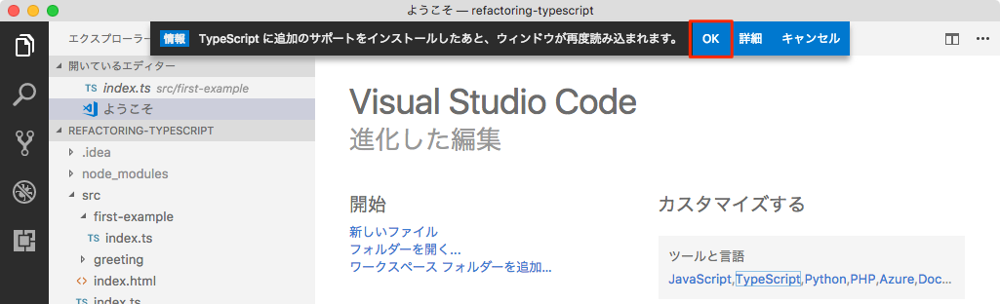

# refactoring-typescript

## 環境構築

yarnをインストールします。

```console
$ npm install -g yarn
```

プロジェクトの依存パッケージをインストールします。

```console
$ yarn install
```

### WebStorm の設定

メニューバーから｢WebStorm - Preferences...｣を選択します。



｢Languages & Frameworks - TypeScript｣を選択し、赤枠にチェックを入れます。



｢Languages & Frameworks - TypeScript - TSLing｣を選択し、赤枠にチェックを入れます。



### Visual Studio Code の設定

メニューバーから｢ヘルプ - ようこそ｣を選択します。




赤枠の TypeScrip を選択します。



赤枠の OK を選択します。




## コーディングを行う

### 開発サーバーの起動

まず開発サーバーを起動します。

```console
$ yarn serve
```

起動したらブラウザで下記URLにアクセスすることで各画面を確認できます。

* アプリケーション画面: http://localhost:5000/public/
* 単体テスト実行画面: http://localhost:5000/test/

`src` または `test` 配下の `.ts` ファイルを変更すると自動でTypeScriptのコンパイルが実行されます。この後ブラウザをリロードすることで変更した内容を確認することができます。

### 単体テストをコンソールから実行

上記で示したようにブラウザで単体テストの実行を行うことができますが、コンソールでも単体テストを実行することができます。

```console
$ yarn test
```
